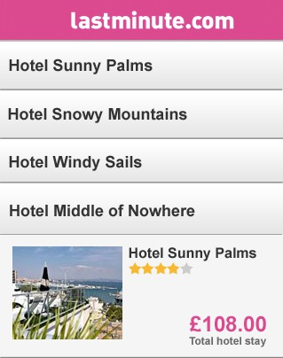
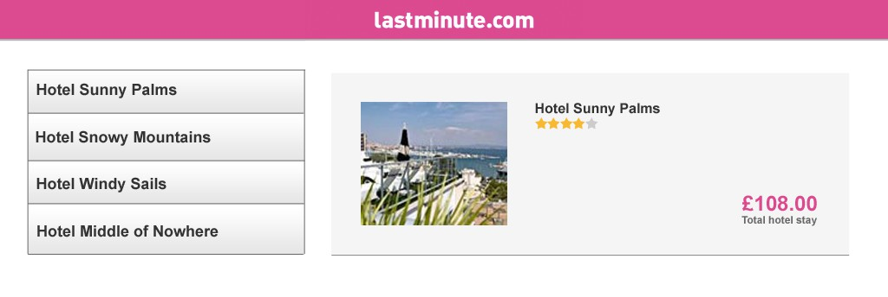

# UI developer assignment

The lastminute.com mobile website includes a number of pages allowing users to book flights and hotels. **We want to reimplement the hotel list page** using mobile-friendly, modular and testable principles.

The following two pictures describe how this new page should look, respectively on small and larger screen devices.

**Mobile design**

**Desktop Design**

## Development
Put the sources for this assignment in the `public` directory.

## Breakpoints
Use **640 pixels** as a breakpoint value.

## Behaviour
The interaction with the page is simple: whenever the user clicks an hotel name in the list, the description panel should be updated with the relevant hotel information.

## Data
The hotel data is provided via a Dyson mock server. In order to make it run, do as follows:
* Have node.js (>=0.12) and npm installed.
* Run `npm install`
* Run `npm start`
* This will launch a server on http://localhost:8765 that will provide you with some routes to retrieve the data:
  * http://localhost:8765/api/hotels/list --> Will respond with the full list of hotels (names and ids)
  * http://localhost:8765/api/hotels/:id --> Will respond with the full information for the desired hotel. The hotel entity references an image located in the `images` directory.

## No library allowed

We are keen on evaluating your deep understanding of JavaScript, therefore **you should not use any library** in the application code.

You may use the most recent version of the EcmaScript standard, as long as you use an ES6/7 to ES5 transpiler.

Keep your code clean, simple yet modular and extensible.

You are welcome to use any CSS preprocessor. Support for IE is not required.

## Testing
Remember that the **automated and self-checking tests are mandatory**. You should provide sufficient evidence that your solution is complete by, as a minimum, indicating that it works correctly against the supplied test data. For this part, feel free to use any library or framework.
